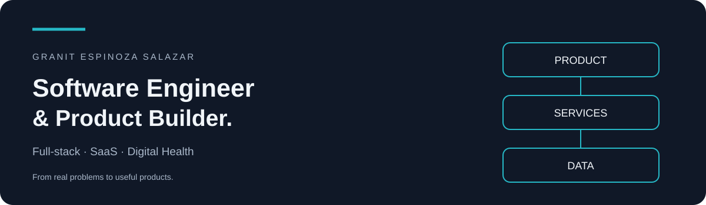

<picture>
  <source media="(prefers-color-scheme: light)" srcset="assets/banner-light.svg">
  
</picture>

[LinkedIn](https://www.linkedin.com/in/granitespinoza/) · [Español](docs/README.es.md)

### Turning real problems into useful products.

I'm **Granit Espinoza Salazar**, a software engineer and Computer Science student at **UTEC**. I build digital products for Latin America, connecting product decisions with software architecture and implementation.

- **Psicogni — CTO & Co-Founder:** product and technical direction for a clinical SaaS for independent mental health professionals.
- **Glucky Health — Software Engineer:** clinical information workflows, patient engagement and automation.
- **Wellnet — Software Engineer:** backend features, billing flows and data architecture for corporate wellbeing.

### My toolkit

| Area | Technologies I work with |
| :--- | :--- |
| Interfaces | TypeScript · React · Next.js |
| Services | Node.js · NestJS · Express |
| Data | PostgreSQL · Drizzle ORM · SQL |
| Automation | Python · Git |

### Public work

These repositories showcase academic and demonstration projects alongside my professional work.

| Project | What you can explore |
| :--- | :--- |
| [UTEC Diagram](https://github.com/granitespinoza/UTECdiagram) | Cloud Computing hackathon project with a React + TypeScript frontend. |
| [Django Quality Demo](https://github.com/granitespinoza/django-quality-demo) | A quality-engineering demonstration using Django, pytest, coverage, SonarQube and Docker. |
| [Educational Writing Tutor](https://github.com/granitespinoza/tutor-ai-final-v-2-4-5) | A React + TypeScript frontend prototype with student and teacher dashboards using simulated data. |

### How I build

Understand the problem → define the scope → model the data → build → validate → iterate.

I care about clear architecture, maintainable code and features that solve a concrete problem. I'm also exploring AI-assisted development and automation with explicit validation.

**Let's connect:** [linkedin.com/in/granitespinoza](https://www.linkedin.com/in/granitespinoza/)
